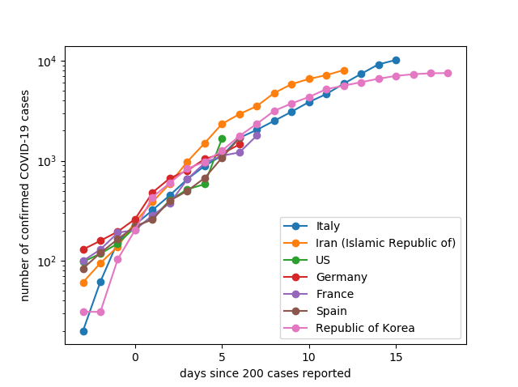
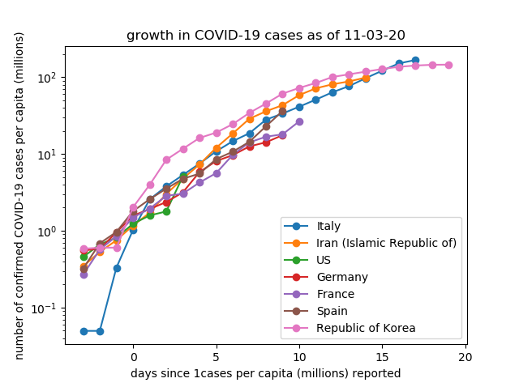

# COVID
 
 Visualizations of COVID-19 case numbers. Data was taken from the [Johns Hopkins COVID-19 dashboard](https://github.com/CSSEGISandData/COVID-19).

## COVID-19 growth

COVID-19 generally follows a similar growth pattern. The below is updated on March 11, 2020 and shows the number of cases in the days since >200 cases were reported in that country. The USA looks to be 7-10 days behind Italy.

If you look at cases per capita, the USA is growing just as quickly but is not nearly as saturated (so far).

